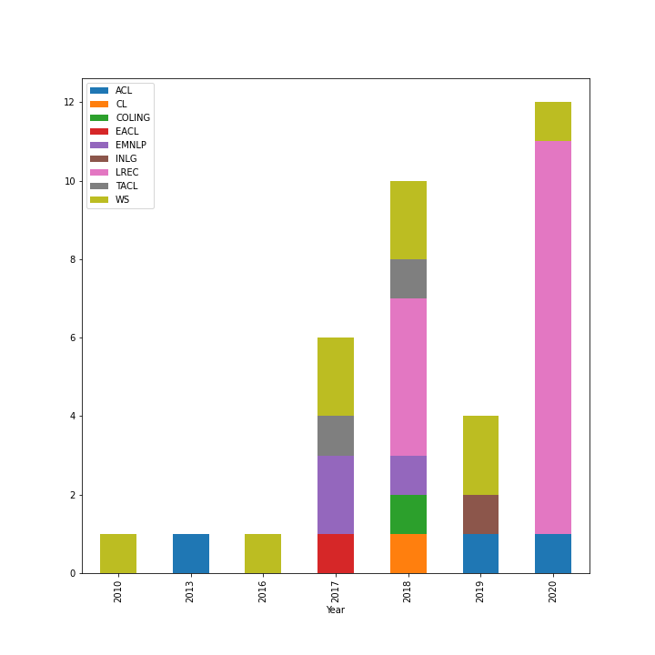

# A Systematic Review of Reproducibility Research in Natural Language Processing

Anya Belz, Shubham Agarwal, Anastasia Shimorina, Ehud Reiter, "A Systematic Review of Reproducibility Research in Natural Language Processing", EACL 2021. [[arXiv](https://arxiv.org/abs/2103.07929)] [[ACL Anthology](https://www.aclweb.org/anthology/2021.eacl-main.29/)]

## List of Papers Reviewed

See [this spreadsheet](https://docs.google.com/spreadsheets/d/1sq9rEQBxlqBSsb4_vwSpS75JiY4EcI_o8RAWb2p_zrE/edit?usp=sharing).

See [this README](./resources#list-of-annotated-papers) also for the list of papers with annotation (equivalent to the tab "Annotated papers" in the spreadsheet above).

## Requirements

We used Python3 for our experiments. We oftenly use `f-strings` and `typing` in our code. Some basic familiarity is required. 

```
conda create -n repro python=3.7 -y
eval "$(conda shell.bash hook)"
conda activate repro
pip install matplotlib numpy==1.19.0 pandas nltk wordcloud seaborn
conda install jupyter
```

## Running code

```
conda activate repro
jupyter notebook
```

All code resides in the `analysis.ipynb` notebook in the [notebook](./notebooks/analysis.ipynb) folder to reproduce Figure 1.  



## Citing

```
@inproceedings{belz-etal-2021-systematic,
    title = "A Systematic Review of Reproducibility Research in Natural Language Processing",
    author = "Belz, Anya  and
      Agarwal, Shubham  and
      Shimorina, Anastasia  and
      Reiter, Ehud",
    booktitle = "Proceedings of the 16th Conference of the European Chapter of the Association for Computational Linguistics: Main Volume",
    month = apr,
    year = "2021",
    address = "Online",
    publisher = "Association for Computational Linguistics",
    url = "https://www.aclweb.org/anthology/2021.eacl-main.29",
    pages = "381--393",
    abstract = "Against the background of what has been termed a reproducibility crisis in science, the NLP field is becoming increasingly interested in, and conscientious about, the reproducibility of its results. The past few years have seen an impressive range of new initiatives, events and active research in the area. However, the field is far from reaching a consensus about how reproducibility should be defined, measured and addressed, with diversity of views currently increasing rather than converging. With this focused contribution, we aim to provide a wide-angle, and as near as possible complete, snapshot of current work on reproducibility in NLP, delineating differences and similarities, and providing pointers to common denominators."
}
```
